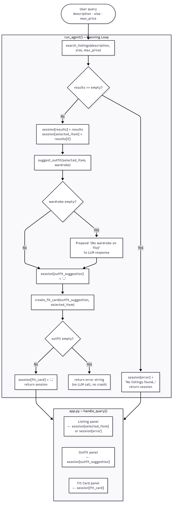

# FitFindr — planning.md

> Complete this document before writing any implementation code.
> Your spec and agent diagram are what you'll use to direct AI tools (Claude, Copilot, etc.) to generate your implementation — the more specific they are, the more useful the generated code will be.
> Your planning.md will be reviewed as part of your submission.
> Update it before starting any stretch features.

---

## Tools

List every tool your agent will use. For each tool, fill in all four fields.
You must have at least 3 tools. The three required tools are listed — add any additional tools below them.

### Tool 1: search_listings

**What it does:**
Searches the mock listings dataset for items that match a user's description, size, and budget. Returns a ranked list of matching listings sorted by relevance so the agent can pick the best result.

**Input parameters:**
- `description` (str): A free-text query describing what the user wants (e.g. "vintage graphic tee"). Used to match against `title`, `description`, and `style_tags` fields in the listings.
- `size` (str): The desired size (e.g. "M", "S/M", "W28"). Matched against the `size` field of each listing.
- `max_price` (float): The maximum price the user is willing to pay. Filters out any listing whose `price` exceeds this value.

**What it returns:**
A list of listing dictionaries, each containing: `id`, `title`, `description`, `category`, `style_tags`, `size`, `condition`, `price`, `colors`, `brand`, and `platform`. Returns an empty list if no listings match all three criteria.

**What happens if it fails or returns nothing:**
The agent does not proceed to `suggest_outfit`. Instead, it tells the user that no listings matched and suggests concrete changes: try a different size, raise the budget, or use broader search terms. The interaction ends there.

---

### Tool 2: suggest_outfit

**What it does:**
Sends the selected listing and the user's wardrobe to the LLM (Groq `llama-3.3-70b-versatile`) and asks it to suggest a specific outfit combination. Returns a short, styled natural-language recommendation grounded in the wardrobe items the user already owns.

**Input parameters:**
- `new_item` (dict): The top listing returned by `search_listings` — a full listing dict with fields `title`, `description`, `category`, `style_tags`, `size`, `condition`, `price`, `colors`, `brand`, `platform`.
- `wardrobe` (dict): A wardrobe object with an `items` key containing a list of wardrobe dicts. Each item has: `id`, `name`, `category`, `colors`, `style_tags`, and optional `notes`. Loaded via `get_example_wardrobe()` from `utils/data_loader.py`.

**What it returns:**
A single plain-text string — a 2–3 sentence outfit suggestion describing which wardrobe pieces to pair with the new item and any specific styling notes (e.g. "Roll the sleeves once and tuck the front corner slightly for shape.").

**What happens if it fails or returns nothing:**
If `wardrobe['items']` is empty, the agent still calls the LLM but omits wardrobe context, asking it to suggest a general styling idea for the new item alone. It prepends a note to the response: "(No wardrobe on file — here's a general styling suggestion.)" so the user knows the wardrobe wasn't used.

---

### Tool 3: create_fit_card

**What it does:**
Sends the outfit suggestion and the selected listing to the LLM and asks it to write a short, casual social-media caption in the style of a thrift haul post. Returns a single ready-to-post string the user can copy directly.

**Input parameters:**
- `outfit` (str): The outfit suggestion string returned by `suggest_outfit`. Must be non-empty — the function guards against an empty string and returns an error message rather than crashing.
- `new_item` (dict): The selected listing dict (same object passed to `suggest_outfit`), used to pull in the item's `title`, `price`, and `platform` for the caption.

**What it returns:**
A single plain-text string of 1–2 casual sentences suitable for a social-media caption (e.g. *"thrifted this faded band tee off depop for $22 and honestly it was made for my wide-legs 🖤 full look in my stories"*). LLM temperature should be set high enough (≥ 0.9) that repeated calls produce meaningfully different outputs.

**What happens if it fails or returns nothing:**
If `outfit` is an empty string or `None`, the function returns the string `"Unable to generate a fit card — no outfit suggestion was provided."` without calling the LLM and without raising an exception.

---

### Additional Tools (if any)

<!-- Copy the block above for any tools beyond the required three -->

---

## Planning Loop

**How does your agent decide which tool to call next?**

1. **Call `search_listings`** with the `description`, `size`, and `max_price` extracted from the user's message. Store the result in `session["results"]`.
2. **Check `session["results"]`:** if the list is empty, set `session["error"] = "No listings found for [query] in size [size] under $[price]. Try broadening your search terms, adjusting the size, or raising your budget."` and return early — do **not** proceed to step 3.
3. **Set `session["selected_item"] = session["results"][0]`** (top result by relevance).
4. **Call `suggest_outfit`** with `session["selected_item"]` and the user's wardrobe (loaded via `get_example_wardrobe()`). Store the returned string in `session["outfit_suggestion"]`.
5. **Call `create_fit_card`** with `session["outfit_suggestion"]` and `session["selected_item"]`. Store the returned string in `session["fit_card"]`.
6. **Done** — return the full `session` dict. The agent knows it's finished when `session["fit_card"]` is set (happy path) or `session["error"]` is set (error path).

---

## State Management

**How does information from one tool get passed to the next?**

All state lives in a single `session` dict that is initialized at the start of `run_agent()` and returned at the end. Its keys are:

| Key | Type | Set by | Used by |
|-----|------|--------|---------|
| `query` | str | `run_agent()` on entry | logged / display |
| `results` | list[dict] | `search_listings` | planning loop branch check |
| `selected_item` | dict or None | planning loop (= `results[0]`) | `suggest_outfit`, `create_fit_card` |
| `outfit_suggestion` | str or None | `suggest_outfit` | `create_fit_card` |
| `fit_card` | str or None | `create_fit_card` | final output panel |
| `error` | str or None | planning loop (error branch) | final output panel |

No globals or class attributes are used. Each tool receives its inputs as explicit arguments — state is only read from `session` inside `run_agent()` and then passed explicitly into each tool call.

---

## Error Handling

For each tool, describe the specific failure mode you're handling and what the agent does in response.

| Tool | Failure mode | Agent response |
|------|-------------|----------------|
| search_listings | No results match the query | Sets `session["error"]` to: *"No listings found for '[query]' in size [size] under $[price]. Try broadening your search terms, adjusting the size, or raising your budget."* Returns immediately — `suggest_outfit` is never called. |
| suggest_outfit | Wardrobe is empty (`wardrobe['items'] == []`) | Still calls the LLM but without wardrobe context. Prepends *"(No wardrobe on file — here's a general styling suggestion.)"* to the returned string so the user knows. Does not crash or return `None`. |
| create_fit_card | `outfit` is empty string or `None` | Returns the string *"Unable to generate a fit card — no outfit suggestion was provided."* without calling the LLM. Does not raise an exception. |

---

## Architecture

---

## AI Tool Plan

<!-- For each part of the implementation below, describe:
     - Which AI tool you plan to use (Claude, Copilot, ChatGPT, etc.)
     - What you'll give it as input (which sections of this planning.md, your agent diagram)
     - What you expect it to produce
     - How you'll verify the output matches your spec before moving on

     "I'll use AI to help me code" is not a plan.
     "I'll give Claude my Tool 1 spec (inputs, return value, failure mode) and ask it to implement
     search_listings() using load_listings() from the data loader — then test it against 3 queries
     before trusting it" is a plan. -->

**Milestone 3 — Individual tool implementations:**

For each tool I'll paste the corresponding spec block from `planning.md` ("What it does", "Input parameters", "What it returns", "What happens if it fails") into Claude and ask it to implement that single function in `tools.py` using `load_listings()` or the Groq client as appropriate. Before running any generated code I'll check: (1) does it use the exact parameter names from the spec? (2) does it handle the failure mode without raising an exception? Then I'll run `pytest tests/test_tools.py` against at least three inputs per tool — a match, a no-match, and an edge case (empty wardrobe for `suggest_outfit`, empty outfit string for `create_fit_card`) — and confirm every test passes before moving on.

**Milestone 4 — Planning loop and state management:**

I'll give Claude the Architecture diagram above plus the Planning Loop and State Management sections and ask it to implement `run_agent()` in `agent.py`. Before running it, I'll verify: does the generated code branch on `results == []`? Does it store `selected_item` from `results[0]` in the session dict before calling `suggest_outfit`? Does it pass `session["outfit_suggestion"]` explicitly to `create_fit_card` rather than re-calling the LLM? I'll test two paths: the happy path with the example query (print `session["selected_item"]` and confirm it's the same dict passed into `suggest_outfit`) and the error path with a no-results query (confirm `session["error"]` is set and `session["fit_card"]` is `None`).

---

## A Complete Interaction (Step by Step)

Write out what a full user interaction looks like from start to finish — tool call by tool call. Use a specific example query.

**Example user query:** "I'm looking for a vintage graphic tee under $30. I mostly wear baggy jeans and chunky sneakers. What's out there and how would I style it?"

**Step 1:**
The agent calls `search_listings(description="vintage graphic tee", size="M", max_price=30.0)`. It loads all listings via `load_listings()`, filters to items whose `size` matches `"M"` and `price` ≤ 30.0, and scores each by how many words from the description appear in `title`, `description`, or `style_tags`. It returns a ranked list of 3 matches. The top result is: `{"id": "lst_006", "title": "Graphic Tee — 2003 Tour Bootleg Style", "price": 24.0, "platform": "depop", "condition": "good", ...}`. The agent sets `session["selected_item"] = results[0]`.

**Step 2:**
The agent calls `suggest_outfit(new_item=session["selected_item"], wardrobe=get_example_wardrobe())`. The wardrobe contains 10 items including baggy straight-leg jeans (`w_001`), chunky white sneakers (`w_007`), and a vintage black denim jacket (`w_006`). The LLM returns: *"Pair this tee with your baggy dark-wash jeans and chunky white sneakers for a relaxed 90s streetwear look. Layer the vintage denim jacket on top and leave it open — roll the tee sleeves once for shape."* The agent sets `session["outfit_suggestion"]` to this string.

**Step 3:**
The agent calls `create_fit_card(outfit=session["outfit_suggestion"], new_item=session["selected_item"])`. The LLM produces: *"found this 2003 bootleg tee on depop for $24 and my baggy jeans have never been happier 🖤 denim jacket sealed the deal"*. The agent sets `session["fit_card"]` to this string and returns the full session.

**Final output to user:**
The Gradio UI renders three panels: (1) the selected listing — title, price, platform, condition; (2) the outfit suggestion paragraph; (3) the fit card caption ready to copy. If Step 1 had returned no results, only an error message would appear and panels 2 and 3 would be empty.
